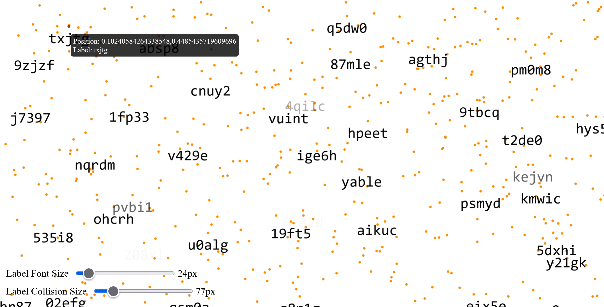

# Deckgl Label Collision
A basic scatterplot example with deck.gl avoiding label collision.

Two sliders dynamically set the label font size and the label collision size (the "buffer" around the labels). 

## Why? 
Due to deck.gl's reactive paradigm, updating deck.gl is not as straight forward as e.g. Leaflet. Working examples are sometimes even more useful than the docs. I hope I'll save you some dev time!

I created this repo mostly for myself for testing labels in:
- [SemanticFinder](https://github.com/do-me/SemanticFinder) 
- [Qdrant Frontend](https://github.com/do-me/qdrant-frontend/)
